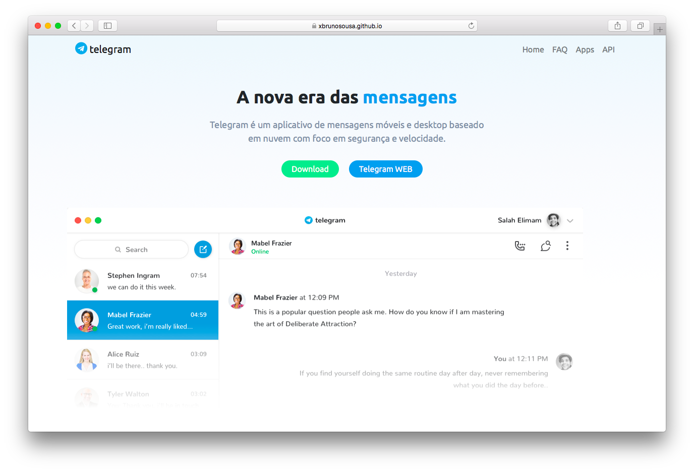

# Landing Page Telegram - React.JS




## Demo:
Online disponível <a href="https://xbrunosousa.github.io/landing-page-react-telegram/build/" target="_blank">aqui</a> por meio do Github Pages.

## Specs:
- Sessão "blog" puxa os posts via API do site "https://telegram.blog.br"
- Usado React.JS, Scss, Bootstrap <a href="https://reactstrap.github.io" target="_blank">(reactstrap)</a>, <a href="https://date-fns.org/" target="_blank">date-fns</a> e <a href="https://github.com/react-ga/react-ga" target="_blank">react-ga</a>
- Flip Cards do "blog" foram construídos apenas com SCSS. Nada de jQuery! 🤓

## Instruções YARN: 
### Uso & Instalação:
Em sua linha de comando digite:
```sh
$ git clone https://github.com/xbrunosousa/landing-page-react-telegram.git && cd landing-page-react-telegram
$ yarn
$ yarn start
```
Acesse a aplicação em `http://localhost:3000` 👨🏻‍💻

### Build:
Em sua linha de comando, dentro do diretório do projeto, digite:
```sh
$ yarn build
```
O build será gerado na pasta 'build'

## Instruções NPM:
### Uso & Instalação:
Em sua linha de comando digite:
```sh
$ git clone https://github.com/xbrunosousa/landing-page-react-telegram.git && cd landing-page-react-telegram
$ npm i
$ npm start
```
Acesse a aplicação em `http://localhost:3000` 👨🏻‍💻

### Build:
Em sua linha de comando, dentro do diretório do projeto, digite:
```sh
$ npm run build
```
O build será gerado na pasta 'build'